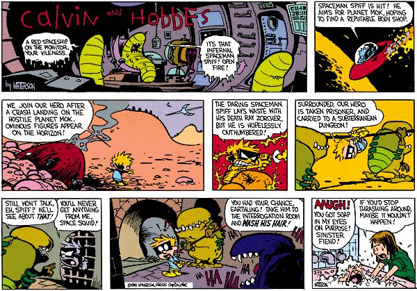
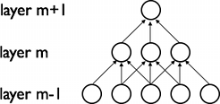

# Art and algorithms
## Vik Paruchuri
## DataQuest (www.dataquest.io)
## vik.paruchuri@gmail.com

---
# The highest form of art

---
# Initial goal

## Wanted to make algorithmic comic strips
## Take existing comic, "remix" to new comics
## Calvin and Hobbes clearly the best
## Spoiler: didn't quite get that far

---
# First step

## Use image recognition
## Calvin and Hobbes are interesting
## Need to make algorithm to extract

---
# Scrape the data

## Scrapy is awesome!
## Download archives
## Rename to reflect dates

---
# Sunday comics

---
# Color is good, usually

## Remove strips with color
## Slice strips up into pieces

---
# The results

## Lots of these:

---
# Make program to crop

## Get lots of training data

---
# Pixels

## Images are made up of pixels
## 100 x 100 image has 10,000

---
# Image as a matrix

## Can think of an image as a matrix
## Each "cell" has the intensity at the pixel

---
# Grayscale vs RGB

## Each cell has R, G, and B intensities
## Average all three to get one number (grayscale)

---
# Look at RGB

    array([[[255, 255, 255],
        [249, 249, 249],
        [251, 251, 251],
        [240, 240, 240]],

       [[251, 251, 251],
        [255, 255, 255],
        [239, 239, 239],
        [255, 255, 255]],

       [[243, 243, 243],
        [244, 244, 244],
        [255, 255, 255],
        [250, 250, 250]],

       [[255, 255, 255],
        [255, 255, 255],
        [248, 248, 248],
        [255, 255, 255]]], dtype=uint8)

---
# Use openCV

## Haar cascade features

---
# openCV train

## https://github.com/mrnugget/opencv-haar-classifier-training
## This repo is a big help when training with openCV

---
# Results not so good

## Probably due to varied image sizes

---
# Next: Own algorithm

## 2d image to 1d vector
## Features: Local binary patterns

---
# Training

## Use random forest classifier (sklearn)
## Separate models for calvin and hobbes

---
# Results

## Slice up images
## Separate predictions for each slice
## Pretty good results

---
# Other approaches

## Also tried a KNN-based solution, but not as good

---
## Calvin appearances

---
## Hobbes appearances

---
# Bonus!

## Decided to look into deep learning
## CNNs are good for this

---
# C+H on learning

---
# Use pylearn2

## Documentation is sparse
## Define models in yaml

    !obj:pylearn2.train.Train {
    dataset: &train !obj:conv_dataset.CHImages {
        which_set: 'calvin',
        start: 0,
        stop: %(train_stop)i,
        one_hot: True
    },
    model: !obj:pylearn2.models.mlp.MLP {
        batch_size: %(batch_size)i,
        input_space: !obj:pylearn2.space.Conv2DSpace {
            shape: &window_shape [48, 48],
            num_channels: 3
        },

---
# CNN

## Feed in images with calvin, and images without
## Learn a neural network
## Add a final layer to output predicted classification

---
# Results

## Pretty good!  Only 18% misclassified
## Can't easily find a "box" for calvin, though

---
# And, I did generate some art!

## Use markov chains to learn pixel intensity sequences

---
# Results

## Construct image from left to right
## Make chains for left, top (and spaced out variations)

---
# Ways to improve detection

## Spend more time on tuning CNNs
## Do preprocessing on images (normalize intensity, etc)
## Augment training data with rotations

---
# Ways to build out art generation

## Learn SVG paths, not single pixels
## Hand label generated art
## Genetic algo?
## Use something like nodebox to sketch

---

## Want to learn about data science?  Check out www.dataquest.io!

### This presentation available at: https://github.com/VikParuchuri/bostonpython2015
